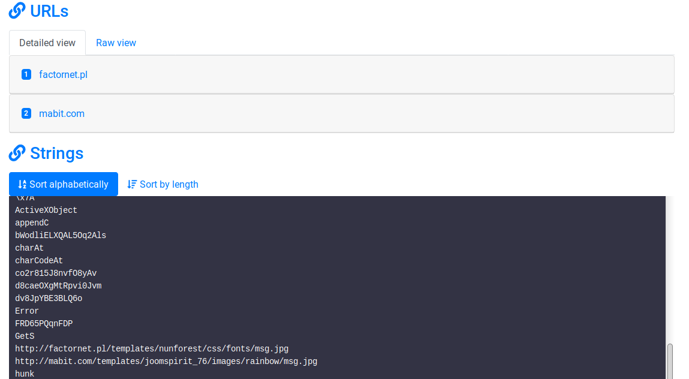
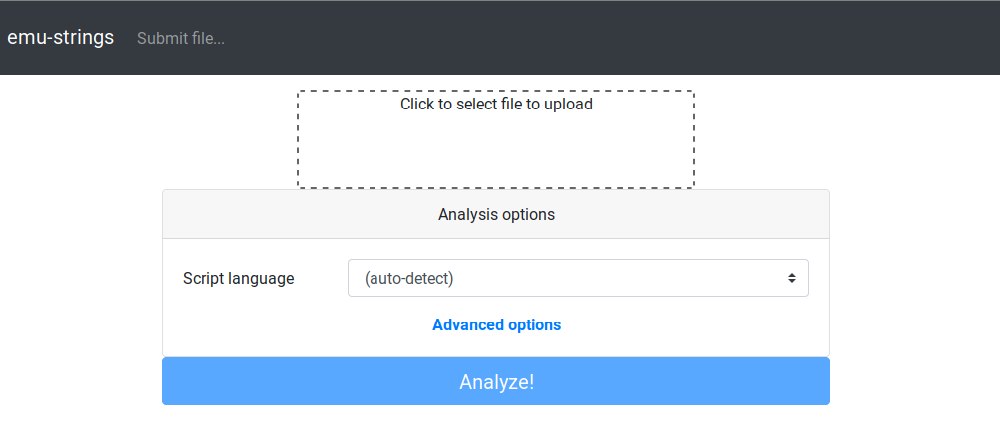
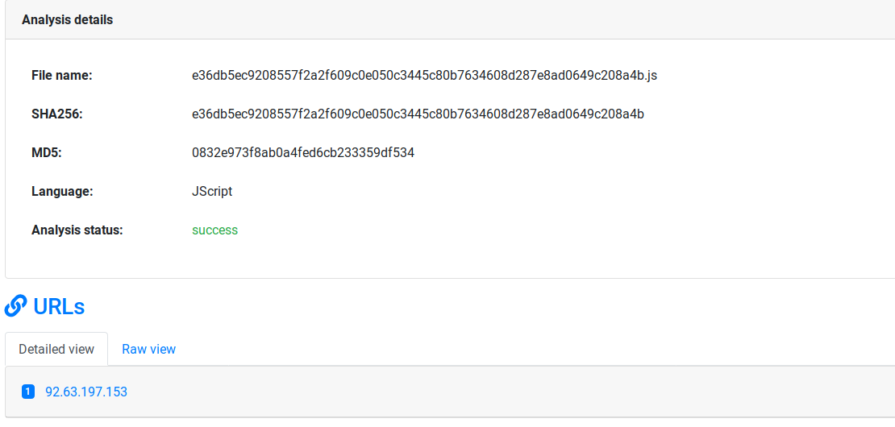

<p align="center">
  
</p>

**Emu-strings** - JScript/VBScript malware analyzer based on native Windows Script Host engine.

The main idea is to provide a tool which reveal all useful *strings* that occur during script execution. In most cases, strings are heavily obfuscated and evaluated at runtime. These are including useful IoCs such as distribution site URLs, OLE Automation object identifiers, eval'ed code snippets etc.



Solution is based on binary-instrumented Windows Script Host engine which is executed in Wine environment. Wine is running inside Docker containers providing separation between concurrently executing instances. 

Network connections made by malware are diverted to simple fakenet, which includes HTTP and DNS service. HTTP server is returning only `500 Internal Server Error` responses, giving script a chance to contact with fallback sites. 

## Requirements

* Linux kernel >= 4.11 (supporting `ip_unprivileged_port_start` sysctl)
* Docker & Docker Compose installed
* at least 8 GB of RAM (recommended 16 GB)
 
Actual requirements are depending on the number of parallel Winedrop instances and DinD configuration.

## Installation

The first step is to clone repository

```bash
$ git clone https://github.com/psrok1/emu-strings.git
```

Then pull latest emu-strings images:
```bash
$ docker-compose pull
```

Finally you can configure and run the emu-strings engine. Start with customizing `docker-compose.yml` depending on your needs. See a few tips below:

* Web interface is exposed at `64205` port. If you want to change that, modify `emu-app` service settings. 
* Limit of concurrent analyzer instances is set to 4. If you want to run more - set `emu-daemon.build.args.concurrent` value.
* If you are running in low-memory environment, consider turning off tmpfs mount of `/var/lib/docker` in DinD container. This will drastically drop analysis performance, but will make you save few gigabytes of memory.

After customizing `docker-compose.yml` just run application.

```bash
$ docker-compose up
```

Web interface in default configuration can be found at `http://127.0.0.1:64205`

## Installation from source code

The first step is to clone repository including submodules:

```bash
$ git clone --recurse-submodules https://github.com/psrok1/emu-strings.git
```

Then build an Winedrop image. This may take a while because all components will be built from scratch (including Wine).

```bash
$ cd emulators ; ./build.sh 
```

Finally just build application and run.

```bash
$ docker-compose up --build
```

## Usage

Go to `Submit file...` and pass the malicious script for analysis. 



Default `auto-detect` mode will try to guess script language by looking for characteristic keywords, but keep in mind that it doesn't work for Encoded (jse/vbe) scripts.

After few minutes of waiting the results will be shown:



If results are not satisfying and sample execution reached its timeout, expand `Advanced settings` in submission window and try to give it more time. 60 seconds are enough for most samples, but there are few exceptions.

## Box-js integration

Emu-strings includes optional integration with [great tool Box-js made by CapacitorSet](https://github.com/CapacitorSet/box-js). It can be used as a secondary engine for JScript samples. Tool is running both Winedrop and Box-js engines at the same time during analysis, combining the results.

Integration was made mainly for comparison purposes, so it wasn't well-tested. If you still want to include Box-js analyses, just build Docker image using commands presented below:

```bash

cd emulators
( cd boxjs; docker build . -t emus-box-js )
docker save emus-box-js -o images/emus-box-js.tar && chmod 644 emus-box-js.tar

``` 

## Disclaimer

Project was made mainly for my MSc thesis and should be considered more as PoC rather than production-ready solution. Thesis [can be found here](https://0xcc.pl/static/msc/psrok1-msc.pdf), but it's *"tylko po polsku"* and no English version is planned.

Regardless that fact, I consider emu-strings as good and working platform for further experiments so I intend to develop the tool for malware analysis purposes. Solution was tested on bunch of samples and works pretty well.

In case of any problems, create an issue or [contact me](https://0xcc.pl/contact.html).